# Smart Expense Tracking Implementation Plan

Last updated: 2026-06-26

## Stack Direction

Android app:
- Kotlin
- Jetpack Compose
- Android Photo Picker and CameraX
- Room for local export history
- Google AI Edge APIs or LiteRT-LM for local extraction

Windows automation:
- Hermes agent as scheduler/orchestrator
- PowerShell action
- Excel automation or Microsoft Graph workbook APIs depending on workbook access behavior
- Local state file for idempotency, plus workbook-level duplicate checks

Data exchange:
- One JSON handoff file per expense
- Versioned schema
- Microsoft Graph upload to OneDrive as the queue/sync transport

Excel integration:
- Target workbook: `D:\OneDrive\Documents\2_Others\Expenses_finance\Canada plan.xlsx`
- Target sheet name: monthly `YYYY-MM`
- Insert new expense rows after row 12.
- Update columns F and G for inserted rows after their exact meanings are confirmed.
- Detect similar existing records by date, shop/location/service, and amount before inserting.

## Architecture

```mermaid
flowchart LR
    A["Android receipt app"] --> B["Local model extraction"]
    B --> C["User review and correction"]
    C --> D["Microsoft Graph upload to OneDrive handoff folder"]
    D --> E["Windows OneDrive sync"]
    E --> F["Hermes polling agent"]
    F --> G["Validate and detect similar records"]
    G --> H["PowerShell Excel update"]
    H --> I["Archive processed file"]
```

## Phases

### Phase 0: Requirements and Feasibility

Status: ✅ Done

Deliverables:
- Requirements draft
- Feasibility summary
- Open decisions list
- Initial implementation plan

### Phase 1: Integration Spikes

Status: Pending

Goals:
- Verify the Google AI Edge API or LiteRT-LM Android extraction path.
- Prototype receipt extraction, including whether OCR/preprocessing is required.
- Verify Microsoft Graph upload from Android to the target OneDrive handoff folder.
- Verify Hermes can run the required PowerShell action.
- Verify row insertion after row 12 in `Canada plan.xlsx` against a copy of the real workbook.
- Verify duplicate/similar-record detection against the monthly sheet.

### Phase 2: Android MVP

Status: Pending

Goals:
- Capture/import receipt image.
- Extract receipt fields on-device.
- Review and correct extracted data.
- Upload JSON handoff file to OneDrive using Microsoft Graph.
- Track export status locally.

Testing:
- Unit tests for extraction response parsing.
- Unit tests for handoff schema generation.
- Unit tests for validation rules.
- UI tests for review/edit flow where practical.

### Phase 3: Windows Agent MVP

Status: Pending

Goals:
- Poll handoff folder every 5 minutes.
- Validate JSON files.
- De-duplicate by expenseId.
- Check for similar date/shop/location/amount records.
- Insert row after row 12 in the `YYYY-MM` monthly worksheet.
- Update columns F and G according to the confirmed mapping.
- Archive processed files and quarantine failures.

Testing:
- Unit tests for schema validation.
- Unit tests for Excel row mapping.
- Unit tests for idempotency.
- Integration test using a sample workbook.

### Phase 4: Receipt Photo Link

Status: Pending

Goals:
- Keep using Amazon Photos as the phone backup location.
- Add receiptPhotoLink to the handoff schema only when a stable Amazon Photos link is available.
- Include the link in Excel only when present.

Testing:
- Unit tests for optional-link handling.
- Integration test that missing links do not block expense processing.

## Design Principles

- Prefer stable documented APIs over UI automation.
- Keep the handoff file small, structured, and versioned.
- Treat OneDrive as eventually consistent.
- Make every processing step idempotent.
- Require human review before export in the MVP.
- Keep cloud AI disabled by default.
- Do not duplicate receipt images into OneDrive for the MVP.

## Definition of Done

A planned task is done only when:
- implementation is complete
- unit tests cover the behavior
- behavior is checked against `docs/requirements.md`
- relevant docs/status files are updated
- the task status is marked ✅ Done
