# Smart Expense Tracking Implementation Plan

Last updated: 2026-09-14

## Stack Direction

Android app:

- Kotlin
- Jetpack Compose
- Android Photo Picker and CameraX
- Room for model-profile metadata, selector state, and local export history
- Provider-based extraction with local Google AI Edge/LiteRT-LM as the default provider
- Optional user-configured OpenAI-compatible API providers
- Settings screen with persistent multi-profile management and a Model Selector
- Single-activity Compose navigation with a focused Main receipt workflow and separate Settings destination

Windows automation:

- Hermes agent as scheduler/orchestrator
- Deterministic PowerShell action running in Hermes script-only/no-agent mode
- Desktop Excel COM for native workbook updates
- Atomic local state under `%LOCALAPPDATA%`, plus workbook-level duplicate checks
- Five-minute polling with quiet empty runs and concise Discord delivery for reportable outcomes

Data exchange:

- One normalized receipt JPEG plus one JSON handoff file per confirmed expense
- Versioned schema
- Microsoft Graph upload to OneDrive as the queue/sync transport
- Image-first publication; the final JSON is the commit marker for the paired export

Excel integration:

- Target workbook: `D:\Users\tuant\OneDrive\Documents\2_Others\Expenses_finance\Canada plan.xlsx` (tests copy it before any write)
- Target sheet name: monthly `YYYY-MM`
- Fill the first safe row from 12-100 where columns F and G are both empty; do not insert or reorder rows.
- Map numeric amount to F, normalized merchant plus `MMM dd` receipt date to G, and a relative receipt-image hyperlink to H.
- Preserve E, O, formulas, formatting, and unrelated workbook content.
- Copy the latest earlier monthly sheet when needed, clear only F:H rows 12-100, and extend `Food Expense Summary` using its existing 89-row monthly detail pattern.
- Skip exact date/amount/normalized-merchant duplicates and quarantine same-date/same-amount merchant conflicts.
- Accept CAD only; quarantine other currencies without conversion.

## Architecture

```mermaid
flowchart LR
    A["Android receipt app"] --> S["Settings Model Selector"]
    S --> P["Room model profiles and selector state"]
    P --> B["Immutable selected-provider snapshot"]
    A --> B
    B --> L["Local Google AI Edge/LiteRT-LM"]
    B --> R["OpenAI-compatible API"]
    L --> C["User review and correction"]
    R --> C
    C --> U["Upload normalized receipt JPEG"]
    U --> D["Publish final JSON handoff"]
    D --> E["Windows OneDrive sync"]
    E --> F["Hermes polling agent"]
    F --> G["Validate and detect similar records"]
    G --> H["PowerShell Excel update"]
    H --> I["Archive processed file"]
```

## Phases

### Phase 0: Requirements and Feasibility

Status: ✅ Done

Deliverables:

- Requirements draft
- Feasibility summary
- Open decisions list
- Initial implementation plan

### Phase 1: Integration Spikes

Status: In Progress

Planning artifact:

- `docs/1.integration-plan.md`

Goals:

- Evaluate and spike optional OpenAI-compatible API extraction behind the same structured extraction contract first.
- Define the Settings Model Selector contract for local and remote providers.
- Verify the Google AI Edge API or LiteRT-LM Android extraction path after the API-provider path is proven. Parser/validation spike is implemented; Android device/model execution is pending.
- Prototype receipt extraction, including whether OCR/preprocessing is required.
- ✅ Done: Implement and unit-test paired Microsoft Graph upload from Android: receipt JPEG first, then the final JSON handoff. Physical-device verification remains.
- ✅ Done: Make Android debug signing use the stable host debug keystore and fail debug builds when the APK certificate does not match the configured MSAL JSON and manifest redirects.
- Implement and verify the Hermes/PowerShell contract in `docs/3.excel-update-hermes-goal.md`.
- Verify next-empty-row mapping, monthly-sheet creation, and summary integration against a disposable copy of the real workbook.
- Verify state-based idempotency, exact duplicate skipping, and similar-record quarantine against the monthly sheet.

### Phase 2: Android MVP

Status: In Progress

Goals:

- Capture/import receipt image.
- ✅ Done: Provide a default-enabled option that reduces selected images larger than 200 KB to strictly below 200 KB before extraction.
- ✅ Done: Separate Main receipt operations from Settings configuration while preserving receipt state across navigation; add compact provider verification, contextual OneDrive readiness, and local Gemma model-file readiness checks.
- ✅ Done: Verify the separated Main and Settings experience on a physical Pixel 7.
- Extract receipt fields with the selected provider, defaulting to on-device extraction.
- ✅ Done: In both direct-image and OCR-text prompts, treat matching itemized and finalized receipts as one transaction and extract the finalized amount including tax and tip without summing receipt totals.
- ✅ Done: Represent distinct transactions from one image as separate `receipts` elements, review and export each independently, and include a detected or manually configured device name in each JSON.
- ✅ Done: Validate strict remote extraction request JSON and the nested receipts schema, reject trailing-comma regressions, and retry `invalid_json` JSON-schema extraction once without `response_format`; provide a default-off Settings Debug control for raw extraction responses and per-receipt generated handoff JSON.
- ✅ Done: Configure, test, save, select, edit, and delete persistent OpenAI-compatible provider profiles through Settings, with secure per-profile credentials and local fallback.
- ✅ Done: Export all saved remote-provider metadata and selector state to a versioned JSON document, and preview/import validated profile files atomically without exporting credentials or changing the current selection.
- Review and correct extracted data.
- ✅ Done: Export unchanged, user-confirmed low-confidence receipts with `confirmed` status and user-edited receipts with `manual` status.
- ✅ Done: After the receipt image succeeds, publish the final Version 2 JSON handoff using Microsoft Graph.
- ✅ Done: Upload a normalized receipt JPEG below 200 KB first and include its deterministic OneDrive-relative path in the Version 2 JSON.
- ✅ Done: Preserve one stable expense ID, export timestamp, image path, and JSON name across retries.
- ✅ Done: Resolve or create the `receipt_images/YYYY-MM` hierarchy idempotently before image upload.
- ✅ Done: Track export status locally with a Room-backed record and actionable retry state.

Testing:

- Unit tests for extraction response parsing.
- ✅ Done: Unit tests for the multiple-receipt prompt contract in both direct-image and OCR-text modes.
- ✅ Done: Unit tests parse complete image and OCR request JSON and verify the receipt schema, provider errors, Debug persistence, and independent export previews.
- Unit tests for provider/model selection rules.
- ✅ Done: Unit tests for provider-configuration JSON round trips, invalid input, credential exclusion, conflict copying, selector preservation, ViewModel confirmation, and atomic Room persistence.
- Unit tests for OpenAI-compatible request construction, credential redaction, and error mapping.
- Unit tests for handoff schema generation.
- ✅ Done: Unit tests for receipt-image normalization, paired path generation, upload ordering, and idempotent retry.
- Unit tests for validation rules.
- UI tests for review/edit flow where practical.
- UI tests for Model Selector behavior where practical.

### Phase 3: Windows Agent MVP

Status: ✅ Done (production job active after Hugo's separate live-activation approval)

Goals:

- ✅ Done: Implement the deterministic PowerShell processor and install its thin Hermes script wrapper.
- ✅ Done: Validate final Version 2 JSON files, filename correlation, paired local receipt images, accepted extraction status, and CAD currency.
- ✅ Done: De-duplicate by atomic local expense-id state and conservative workbook matching.
- ✅ Done: Skip exact date/amount/normalized-merchant duplicates and quarantine same-date/same-amount merchant conflicts.
- ✅ Done: Fill the first safe F/G row from 12-100 in the `YYYY-MM` worksheet, with the amount in F, merchant/date in G, and relative image hyperlink in H.
- ✅ Done: Create a missing monthly sheet by copying the latest earlier month and extend `Food Expense Summary` only when its known structure validates.
- ✅ Done: Preserve valid handoffs when Excel is locked, read-only, full, or structurally unexpected.
- ✅ Done: Archive successful and exact-duplicate files; quarantine ambiguous and invalid files with actionable reasons.
- ✅ Done: Activate job `f6934b4a04fe` after Hugo's separate approval. It runs every five minutes in script-only/no-agent mode, delivers to Discord channel `1549288366992793652`, and is pinned to `gpt-5.6-luna` with high reasoning.

Testing:

- ✅ Done: Unit tests for Version 2 validation, path safety, mapping, row selection, duplicate classification, state atomicity, routing, and Hermes output.
- ✅ Done: Copied-workbook Excel COM tests for insertion, hyperlink behavior, native-content preservation, missing-month creation, and summary extension.
- ✅ Done: Recovery seams for state/archive failures and idempotent reruns; lock/read-only/full handling is covered by deterministic code paths and capacity assertions.
- ✅ Done: The disposable-path Hermes canary completed successfully and Discord message `1549441490327965807` was read back from the configured channel. The production override was removed afterward; following Hugo's separate approval, the production job is active.

### Phase 4: Optional External Receipt Photo Link

Status: Pending

Goals:

- Keep using Amazon Photos as the phone backup location.
- Add receiptPhotoLink to the handoff schema only when a stable Amazon Photos link is available.
- Include the link in Excel only when present.
- Keep this optional full-resolution external link separate from the required normalized OneDrive receipt JPEG.

Testing:

- Unit tests for optional-link handling.
- Integration test that missing links do not block expense processing.

## Design Principles

- Prefer stable documented APIs over UI automation.
- Keep the handoff file small, structured, and versioned.
- Treat OneDrive as eventually consistent.
- Make every processing step idempotent.
- Require human review before export in the MVP.
- Keep cloud AI disabled by default, and require explicit user opt-in before sending receipt data to a remote model provider.
- Keep local and remote extraction behind one provider abstraction and one normalized output contract.
- Upload only the normalized sub-200-KB receipt JPEG required by the expense workflow; Amazon Photos may remain the independent full-resolution backup.

## Definition of Done

A planned task is done only when:

- implementation is complete
- unit tests cover the behavior
- behavior is checked against `docs/requirements.md`
- relevant docs/status files are updated
- the task status is marked ✅ Done
