# Smart Expense Tracking Implementation Plan

Last updated: 2026-09-06

## Stack Direction

Android app:
- Kotlin
- Jetpack Compose
- Android Photo Picker and CameraX
- Room for model-profile metadata, selector state, and local export history
- Provider-based extraction with local Google AI Edge/LiteRT-LM as the default provider
- Optional user-configured OpenAI-compatible API providers
- Settings screen with persistent multi-profile management and a Model Selector

Windows automation:
- Hermes agent as scheduler/orchestrator
- PowerShell action
- Excel automation or Microsoft Graph workbook APIs depending on workbook access behavior
- Local state file for idempotency, plus workbook-level duplicate checks

Data exchange:
- One normalized receipt JPEG plus one JSON handoff file per confirmed expense
- Versioned schema
- Microsoft Graph upload to OneDrive as the queue/sync transport
- Image-first publication; the final JSON is the commit marker for the paired export

Excel integration:
- Target workbook: `D:\OneDrive\Documents\2_Others\Expenses_finance\Canada plan.xlsx`
- Target sheet name: monthly `YYYY-MM`
- Insert new expense rows after row 12.
- Update columns F and G for inserted rows after their exact meanings are confirmed.
- Detect similar existing records by date, shop/location/service, and amount before inserting.

## Architecture

```mermaid
flowchart LR
    A["Android receipt app"] --> S["Settings Model Selector"]
    S --> P["Room model profiles and selector state"]
    P --> B["Immutable selected-provider snapshot"]
    A --> B
    B --> L["Local Google AI Edge/LiteRT-LM"]
    B --> R["OpenAI-compatible API"]
    L --> C["User review and correction"]
    R --> C
    C --> U["Upload normalized receipt JPEG"]
    U --> D["Publish final JSON handoff"]
    D --> E["Windows OneDrive sync"]
    E --> F["Hermes polling agent"]
    F --> G["Validate and detect similar records"]
    G --> H["PowerShell Excel update"]
    H --> I["Archive processed file"]
```

## Phases

### Phase 0: Requirements and Feasibility

Status: ✅ Done

Deliverables:
- Requirements draft
- Feasibility summary
- Open decisions list
- Initial implementation plan

### Phase 1: Integration Spikes

Status: In Progress

Planning artifact:
- `docs/1.integration-plan.md`

Goals:
- Evaluate and spike optional OpenAI-compatible API extraction behind the same structured extraction contract first.
- Define the Settings Model Selector contract for local and remote providers.
- Verify the Google AI Edge API or LiteRT-LM Android extraction path after the API-provider path is proven. Parser/validation spike is implemented; Android device/model execution is pending.
- Prototype receipt extraction, including whether OCR/preprocessing is required.
- ✅ Done: Implement and unit-test paired Microsoft Graph upload from Android: receipt JPEG first, then the final JSON handoff. Physical-device verification remains.
- Verify Hermes can run the required PowerShell action.
- Verify row insertion after row 12 in `Canada plan.xlsx` against a copy of the real workbook.
- Verify duplicate/similar-record detection against the monthly sheet.

### Phase 2: Android MVP

Status: Pending

Goals:
- Capture/import receipt image.
- ✅ Done: Provide a default-enabled option that reduces selected images larger than 200 KB to strictly below 200 KB before extraction.
- Extract receipt fields with the selected provider, defaulting to on-device extraction.
- ✅ Done: In both direct-image and OCR-text prompts, treat matching itemized and finalized receipts as one transaction and extract the finalized amount including tax and tip without summing receipt totals.
- ✅ Done: Configure, test, save, select, edit, and delete persistent OpenAI-compatible provider profiles through Settings, with secure per-profile credentials and local fallback.
- Review and correct extracted data.
- ✅ Done: After the receipt image succeeds, publish the final Version 2 JSON handoff using Microsoft Graph.
- ✅ Done: Upload a normalized receipt JPEG below 200 KB first and include its deterministic OneDrive-relative path in the Version 2 JSON.
- ✅ Done: Preserve one stable expense ID, export timestamp, image path, and JSON name across retries.
- ✅ Done: Resolve or create the `receipt_images/YYYY-MM` hierarchy idempotently before image upload.
- ✅ Done: Track export status locally with a Room-backed record and actionable retry state.

Testing:
- Unit tests for extraction response parsing.
- ✅ Done: Unit tests for the multiple-receipt prompt contract in both direct-image and OCR-text modes.
- Unit tests for provider/model selection rules.
- Unit tests for OpenAI-compatible request construction, credential redaction, and error mapping.
- Unit tests for handoff schema generation.
- ✅ Done: Unit tests for receipt-image normalization, paired path generation, upload ordering, and idempotent retry.
- Unit tests for validation rules.
- UI tests for review/edit flow where practical.
- UI tests for Model Selector behavior where practical.

### Phase 3: Windows Agent MVP

Status: Pending

Goals:
- Poll handoff folder every 5 minutes.
- Validate JSON files.
- De-duplicate by expenseId.
- Check for similar date/shop/location/amount records.
- Insert row after row 12 in the `YYYY-MM` monthly worksheet.
- Update columns F and G according to the confirmed mapping.
- Archive processed files and quarantine failures.

Testing:
- Unit tests for schema validation.
- Unit tests for Excel row mapping.
- Unit tests for idempotency.
- Integration test using a sample workbook.

### Phase 4: Optional External Receipt Photo Link

Status: Pending

Goals:
- Keep using Amazon Photos as the phone backup location.
- Add receiptPhotoLink to the handoff schema only when a stable Amazon Photos link is available.
- Include the link in Excel only when present.
- Keep this optional full-resolution external link separate from the required normalized OneDrive receipt JPEG.

Testing:
- Unit tests for optional-link handling.
- Integration test that missing links do not block expense processing.

## Design Principles

- Prefer stable documented APIs over UI automation.
- Keep the handoff file small, structured, and versioned.
- Treat OneDrive as eventually consistent.
- Make every processing step idempotent.
- Require human review before export in the MVP.
- Keep cloud AI disabled by default, and require explicit user opt-in before sending receipt data to a remote model provider.
- Keep local and remote extraction behind one provider abstraction and one normalized output contract.
- Upload only the normalized sub-200-KB receipt JPEG required by the expense workflow; Amazon Photos may remain the independent full-resolution backup.

## Definition of Done

A planned task is done only when:
- implementation is complete
- unit tests cover the behavior
- behavior is checked against `docs/requirements.md`
- relevant docs/status files are updated
- the task status is marked ✅ Done
